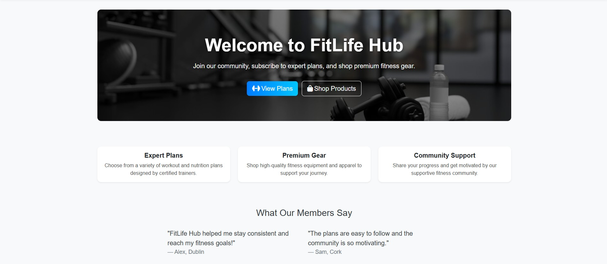
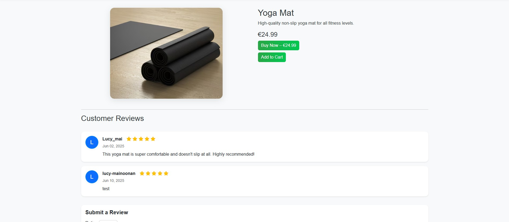
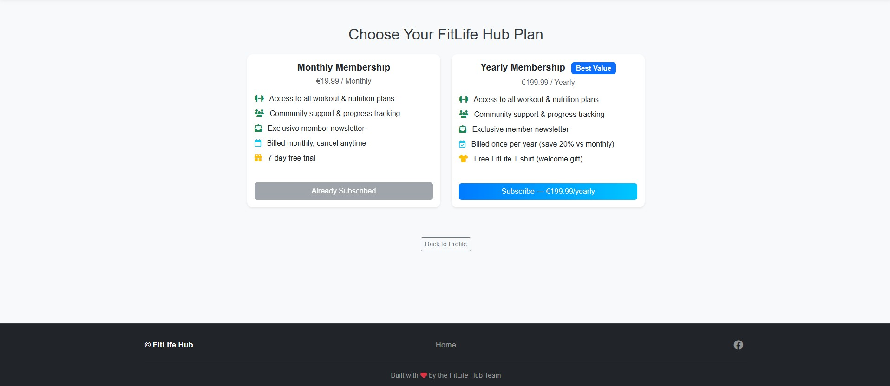
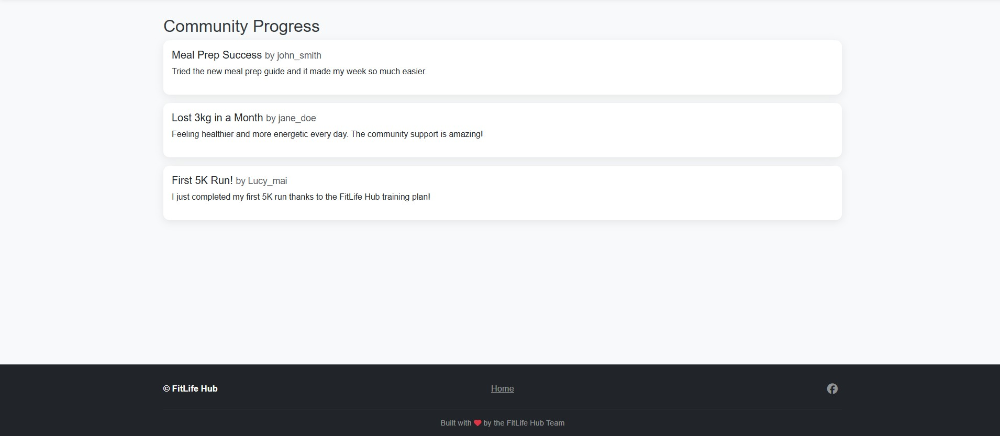
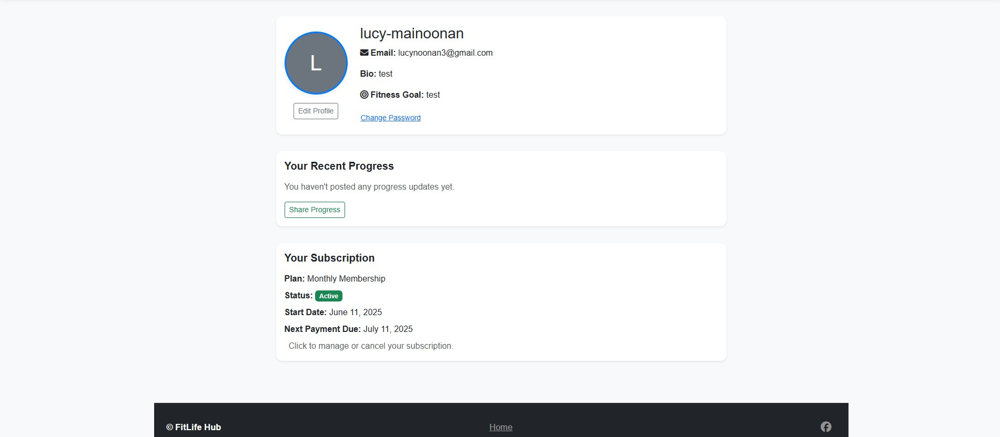
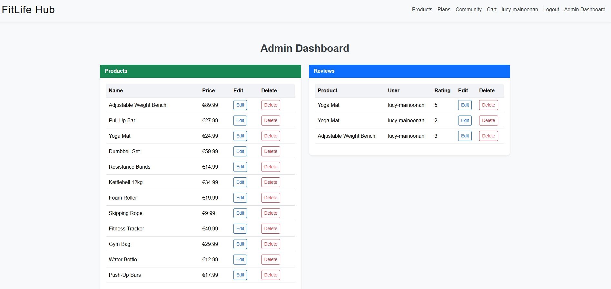
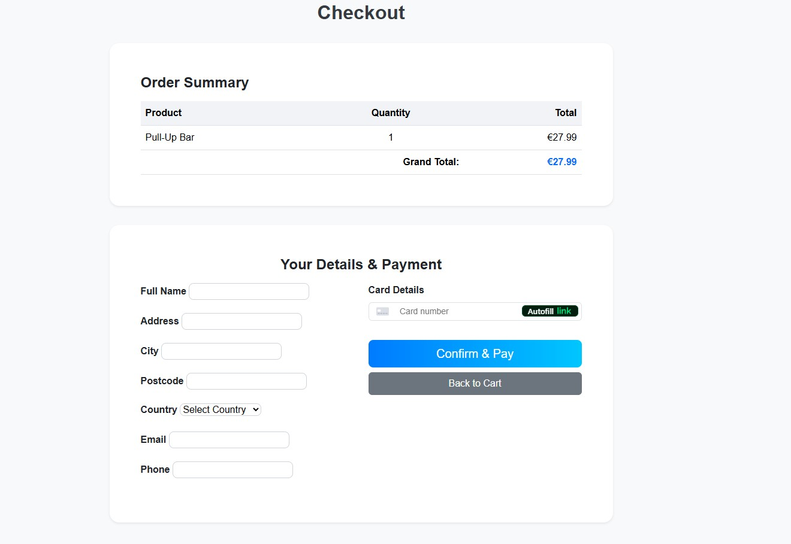
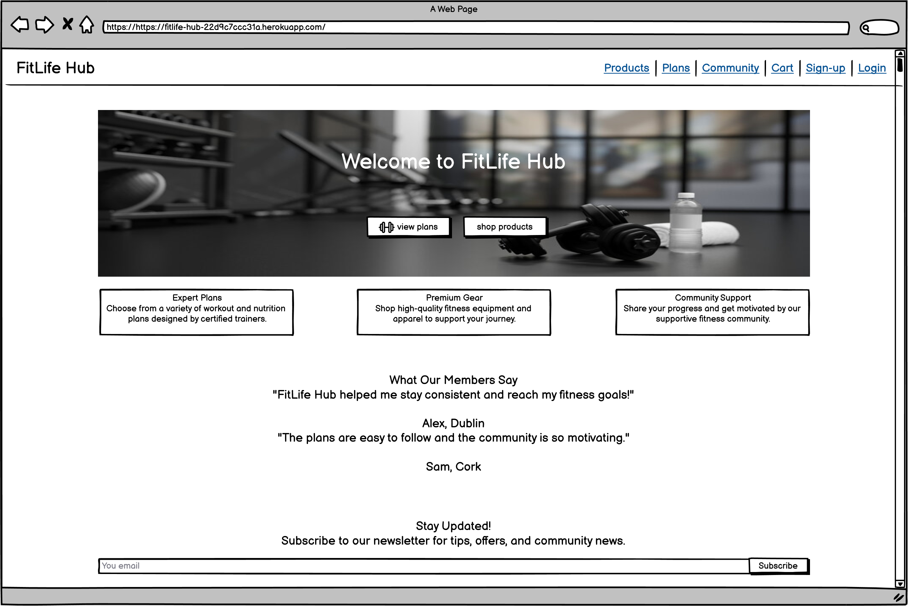
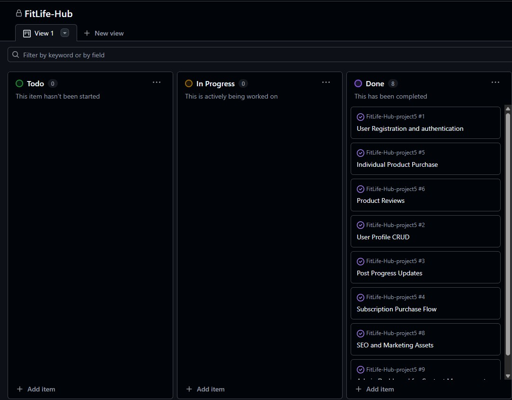

# FitLife Hub


**FitLife Hub** is a full-stack Django e-commerce and fitness community platform. Users can shop for fitness products, subscribe to premium workout plans, track their progress, and engage with a supportive community.

[Live Site Demo](https://fitlife-hub-22d9c7ccc31a.herokuapp.com/)

---

## Table of Contents

- [Project Purpose & Target Audience](#project-purpose--target-audience)
- [Intent, Data Handling & Security](#intent-data-handling--security)
- [Features](#features)
- [Screenshots](#screenshots)
- [Mockups & Wireframes](#mockups--wireframes)
- [Data Schema](#data-schema)
- [Business Model](#business-model)
- [User Stories & Agile Process](#user-stories--agile-process)
- [SEO & Marketing](#seo--marketing)
- [Testing](#testing)
- [Deployment](#deployment)
- [Configuration](#configuration)
- [Credits](#credits)

---

## Project Purpose & Target Audience

FitLife Hub was built to solve a real problem: fitness seekers and small fitness brands lack a single, trusted place that combines commerce, ongoing coaching (subscriptions), and a community that supports visual progress tracking — all while keeping users' data and payments secure.

Rationale and core objectives
- Provide an integrated experience: product discovery + community progress sharing so users avoid juggling multiple services.
- Increase adherence and retention: social accountability (image progress, comments, milestones) combined with subscription plans drives ongoing engagement.
- Enable small trainers and boutique brands to sell products and plans with low friction and secure payments.
- Prioritise privacy and safety: make it easy for users to control visibility of progress images and personal data while protecting financial data via a PCI-compliant provider (Stripe).

Primary target audiences (problems & outcomes)
- Novice fitness users: need accessible plans, affordable gear, and motivation — outcome: guided entry and steady progress.
- Intermediate/advanced users: want curated products and advanced plans — outcome: discover and subscribe to specialised content.
- Trainers & micro-gyms: need a storefront + subscription model and community features to retain clients — outcome: monetise services with minimal overhead.
- Community seekers: want to share progress photos safely and receive encouragement — outcome: social reinforcement without sacrificing privacy.

How the app maps to user needs (example user stories addressed)
- As a new user, I want to find affordable starter kits so I can begin training immediately. (E-commerce + product recommendations)
- As a subscriber, I want to follow a recurring plan and track my progress with photos. (Subscriptions + ProgressUpdate)
- As a user, I want to control who sees my progress photos. (Privacy settings & moderation)
- As a user, I want secure checkout without exposing my card details. (Stripe tokenization)

--- 

## Intent, Data Handling & Security

This section explains why the app was designed this way, what data we collect, and how we protect it.

Purpose-driven design
- Unify commerce, coaching, and community so users get product recommendations, structured plans, and social motivation in one safe place.
- Support micro-businesse (brands) with low-friction commerce and subscription tools so they can scale without heavy engineering overhead.
- Make privacy a first-class feature: explicit visibility controls for progress images and clear account/data deletion flows.

Data classification & storage
- Public content: product pages and public progress posts — hosted on AWS S3 as static/media.
- Protected personal data: profile info, orders, subscriptions — stored in the app database (Postgres in production).
- Payment references: Stripe tokens/IDs only — raw card data is never stored on our servers.

Key security controls
- Transport security: HTTPS enforced (HSTS recommended) for all environments.
- Authentication: Django auth with secure password hashing; enforce strong SECRET_KEY via env vars.
- Authorization: Role-based access controls (member, admin) enforced in views and templates.
- CSRF/XSS/SQLi: Django CSRF middleware, template auto-escaping, and ORM usage to prevent common web attacks.
- Cookie and session safety: SESSION_COOKIE_SECURE, CSRF_COOKIE_SECURE, and HttpOnly flags in production.
- File uploads: Validate MIME types and sizes server-side, use presigned S3 uploads, and limit public exposure based on privacy settings.
- CORS & CORB: Configure S3 and backend CORS to allow only trusted origins and set correct Content-Type headers for media.
- Payments: Integrate with Stripe using client-side tokens and server-side secret keys; comply with PCI scope minimisation.
- Secrets management: All secrets via environment variables; include a .env.example and never commit real keys.
- Monitoring & backups: Use Heroku logs + optional Sentry for errors; enable DB backups and S3 versioning.

Privacy & compliance
- Account deletion and data removal workflows available; email opt-in/out for marketing.
- Follow regional privacy requirements (e.g., support data access/deletion requests for GDPR).

Operational recommendations before production
- Set DEBUG=False, configure ALLOWED_HOSTS, rotate credentials, enable HSTS, and audit S3 bucket permissions.
- Add a CSP header and automated security scans (Snyk, Bandit, etc.).
- Implement rate limiting on auth endpoints and enable monitoring/alerts.

Where to find configuration in this repo
- fithub/settings.py — security and third-party config
- custom_storages.py — S3 storage settings
- subscriptions/* and store/* — payment and subscription logic (store only Stripe tokens/IDs)
- docs/aws-s3-cors.json (or equivalent) — S3 CORS rules to prevent CORB/CORS issues

--- 

## Features

- **E-commerce Store:** Browse and purchase fitness products.
- **Subscription Plans:** Subscribe to premium workout/nutrition plans.
- **User Authentication:** Secure registration, login, and profile management.
- **Role-Based Access:** Admin and member roles with tailored permissions.
- **Community Progress:** Share and view progress updates, including images.
- **Product Reviews:** Leave and read reviews for products.
- **Newsletter Signup:** Stay updated with the latest offers and tips.
- **Responsive Design:** Mobile-friendly and accessible.
- **SEO Optimized:** Meta tags, sitemap, robots.txt, and canonical URLs.
- **Admin Dashboard:** Manage products, orders, users, and content.
- **Progress Tracking:** Visualize your fitness journey with charts and images.
- **Secure Payments:** Stripe integration for subscriptions and purchases.
- **Custom 404 Page:** Friendly error handling and navigation.
- **Accessibility:** Keyboard navigation, ARIA labels, and color contrast.

---

## Screenshots

### Home Page


### Product Detail


### Subscription Plans


### Community Progress


### User Profile


### Admin Dashboard


### Checkout Page


### 404 Error Page


---

## Mockups & Wireframes

- Wireframes and user flows were created using dbdiagram and Balsamiq Wireframes.
- Accessibility and mobile responsiveness were prioritized.
- User flows were tested and refined based on feedback.

### Entity Relationship Diagram


### Wireframe


---

## Data Schema

### Main Models

#### User & Profile
- **User:** Django’s built-in user model.
- **Profile:** Extends User with avatar, bio, and role (`member`, `admin`).

#### Product
- `name`, `description`, `price`, `image`, `stock`

#### Order & OrderItem
- **Order:** `user`, `created_at`, `status`, `total`
- **OrderItem:** `order`, `product`, `quantity`, `price`

#### Review
- `product`, `user`, `rating`, `comment`, `created_at`

#### Plan & Subscription
- **Plan:** `name`, `description`, `price`, `interval`
- **Subscription:** `user`, `plan`, `start_date`, `end_date`, `active`, `stripe_sub_id`

#### ProgressUpdate
- `user`, `title`, `content`, `image`, `created_at`

#### NewsletterSubscriber
- `email`, `subscribed_at`

---

## Business Model

FitLife Hub operates as a hybrid e-commerce and subscription platform:

- **Product Sales:** One-off purchases of fitness products.
- **Subscription Plans:** Recurring revenue from premium plans.
- **Community Engagement:** Drives retention and upselling.
- **Newsletter Marketing:** Builds brand loyalty and reach.

---

## User Stories & Agile Process

### Example User Stories

- As a user, I want to register and log in so I can access my profile and orders.
- As a user, I want to browse and purchase products securely.
- As a user, I want to subscribe to workout plans for ongoing guidance.
- As a user, I want to share my fitness progress with images.
- As an admin, I want to manage products, orders, and users.
- As an admin, I want to moderate community posts and reviews.

### Agile Board



- User stories, tasks, and sprints are tracked in [GitHub Projects](https://github.com/users/LNoonan3/projects/7).

---

## SEO & Marketing

- **Meta Tags:** All pages include descriptive meta titles and descriptions.
- **Canonical URLs:** Ensured for all main pages.
- **Sitemap:** [`core/sitemaps.py`](core/sitemaps.py) generates `sitemap.xml` for search engines.
- **robots.txt:** [`robots.txt`](robots.txt) controls crawler access.
- **404 Page:** Custom 404 with redirect options.
- **No Lorem Ipsum:** All content is meaningful and relevant.
- **Facebook Business Page:** [FitLife Hub on Facebook](https://www.facebook.com/fitlife.hub.25/)
- **Newsletter Signup:** Integrated on the homepage and footer.
- **Open Graph & Twitter Cards:** Social sharing optimized for rich previews.

---

## Testing

### Automated Testing

Automated tests are provided for all major components of the application:

- **Location of tests:**
  - [`core/tests.py`](core/tests.py)
  - [`store/tests.py`](store/tests.py)
  - [`subscriptions/tests.py`](subscriptions/tests.py)
  - [`users/tests.py`](users/tests.py)

- **Coverage:**
  - **Models:** Creation and validation of all main models (e.g., Product, Order, Plan, Subscription, Profile, ProgressUpdate, NewsletterSubscriber).
  - **Views:** Access control, CRUD operations, and correct template rendering for all main views.
  - **Forms:** Validation and submission for user profile, reviews, newsletter signup, etc.
  - **Authentication & Permissions:** Ensures only authorized users can access restricted views.
  - **Cart & Checkout:** Add, update, and remove items from cart; checkout flow and login requirements.
  - **Progress Updates:** Creating, editing, deleting, and permission checks for progress updates.
  - **Newsletter:** Valid and invalid email subscription handling.

- **How to run the tests:**
  ```sh
  python manage.py test
  ```

- **Sample Output:**
  ```
  Found 36 test(s).
  Creating test database for alias 'default'...
  System check identified no issues (0 silenced).
  ....................................
  Ran 36 tests in 63.451s

  OK
  Destroying test database for alias 'default'...
  ```

- **Example Test (from [`store/tests.py`](store/tests.py)):**
  ```python
  def test_review_post(self):
      self.client.login(username='testuser', password='pass')
      url = reverse('store:product_detail', args=[self.product.pk])
      data = {
          'rating': 5,
          'comment': 'Excellent!'
      }
      response = self.client.post(url, data)
      self.assertEqual(response.status_code, 302)
      self.assertTrue(
          Review.objects.filter(
              product=self.product,
              user=self.user,
              rating=5,
              comment='Excellent!'
          ).exists()
      )
  ```

- **Example Test (from [`core/tests.py`](core/tests.py)):**
  ```python
  def test_progress_create_view_valid_post(self):
      self.client.login(username='coreuser', password='pass')
      url = reverse('core:progress_create')
      data = {
          'title': 'New Progress',
          'content': 'Feeling great!'
      }
      response = self.client.post(url, data)
      self.assertEqual(response.status_code, 302)
      self.assertTrue(
          ProgressUpdate.objects.filter(
              title='New Progress',
              user=self.user
          ).exists()
      )
  ```

### Manual Testing

- All CRUD actions tested for immediate UI reflection.
- Responsive design tested on Chrome, Firefox, Edge, and mobile devices.
- Accessibility checked with Lighthouse and manual keyboard navigation.
- Payment and checkout flows tested with test Stripe accounts.
- Image upload for progress updates tested for file type and size validation.
- Admin dashboard tested for product, order, and user management.
- Error handling and custom 404 page tested.
- Newsletter signup tested for valid and invalid email addresses.

### Known Issues

#### Order History Not Working

**Status:** ❌ Not Functional

**Description:** The order history feature does not work when purchasing products through the checkout flow. Orders are created in the database, but users cannot view their order history or order details.

**Why It Doesn't Work:**

1. **Session-Based Cart vs. Database Orders:** The cart system uses Django sessions to store items temporarily. When users proceed to checkout, the cart data is passed to Stripe as metadata.

2. **Webhook Processing Issues:** The [`oneoff_webhook`](store/views.py) function receives Stripe webhook events and attempts to create `Order` objects. However, there are several points of failure:
   - Cart metadata is stringified and may not deserialize correctly
   - Stock validation happens after order creation, potentially creating incomplete orders
   - The webhook may fail silently due to the `@csrf_exempt` decorator and lack of proper error logging

3. **Order Item Creation:** Even when orders are created, the associated [`OrderItem`](store/models.py) records may not be created properly if the webhook processing fails partway through.

4. **Missing Error Handling:** The webhook handler doesn't return detailed error messages, making debugging difficult. Orders may be created in a "pending" state but never transition to "paid."

**Affected Views:**
- [`order_history`](store/views.py) - Queries orders but may return empty results
- [`order_detail`](store/views.py) - Cannot display order details if orders aren't created
- **Templates:** [store/templates/store/order_history.html](store/templates/store/order_history.html) and [store/templates/store/order_detail.html](store/templates/store/order_detail.html)

**What Was Attempted:**

- ✅ Built the complete order history UI with responsive design
- ✅ Implemented database models ([`Order`](store/models.py) and [`OrderItem`](store/models.py))
- ✅ Created views to fetch and display orders
- ✅ Integrated with Stripe checkout and webhooks
- ✅ Added comprehensive templates for order display
- ✅ Implemented order status tracking (pending, paid, shipped, canceled)
- ✅ Added email confirmation via [`send_order_confirmation_email`](store/utils.py)

**Why It Still Doesn't Work:**

The core issue is the mismatch between the session-based cart and the webhook-driven order creation. The Stripe webhook may not fire reliably in development, or the payload metadata may not be properly formatted when passed to the webhook handler. Additionally, without proper logging and error handling in the webhook, failures are silent.

**Recommended Fixes:**

1. Add comprehensive logging to the webhook handler to track what's happening
2. Validate and properly deserialize the cart metadata before processing
3. Use Django signals or a task queue (Celery) for more reliable order creation
4. Implement retry logic for failed webhook events
5. Add proper exception handling and return HTTP 200 only after successful processing

---

## Deployment

### Hosting

- **Production:** Deployed on [Heroku](https://fitlife-hub-22d9c7ccc31a.herokuapp.com/)
- **Static/Media Files:** Managed via AWS S3 for scalability and reliability.
- **Database:** Uses PostgreSQL on Heroku for production, SQLite for local development.

### Prerequisites

- Python 3.12+
- pip
- PostgreSQL (for production)
- Heroku CLI (for deployment)
- AWS account (for S3 storage)

### Deployment Steps

1. **Clone the repository:**
   ```sh
   git clone https://github.com/yourusername/fitlife-hub.git
   cd fitlife-hub
   ```

2. **Install dependencies:**
   ```sh
   pip install -r requirements.txt
   ```

3. **Set environment variables:**
   - Copy `.env.example` to `.env` and fill in your secrets (Django secret key, database URL, Stripe keys, AWS credentials, etc.).
   - Example:
     ```
     SECRET_KEY=your-secret-key
     DATABASE_URL=your-database-url
     STRIPE_PUBLIC_KEY=your-stripe-public-key
     STRIPE_SECRET_KEY=your-stripe-secret-key
     AWS_ACCESS_KEY_ID=your-aws-access-key-id
     AWS_SECRET_ACCESS_KEY=your-aws-secret-access-key
     ```

4. **Run migrations:**
   ```sh
   python manage.py migrate
   ```

5. **Create a superuser (optional, for admin access):**
   ```sh
   python manage.py createsuperuser
   ```

6. **Collect static files:**
   ```sh
   python manage.py collectstatic
   ```

7. **Test locally:**
   ```sh
   python manage.py runserver
   ```
   - Visit `http://localhost:8000` to verify the app works.

8. **Deploy to Heroku:**
   - Log in to Heroku and create a new app:
     ```sh
     heroku login
     heroku create your-app-name
     ```
   - Set Heroku config variables (same as your `.env`):
     ```sh
     heroku config:set SECRET_KEY=your-secret-key
     heroku config:set DATABASE_URL=your-database-url
     # ...other variables...
     ```
   - Push your code:
     ```sh
     git push heroku main
     ```
   - Run migrations on Heroku:
     ```sh
     heroku run python manage.py migrate
     heroku run python manage.py collectstatic --noinput
     ```

9. **Configure AWS S3 for static/media files:**
   - Set up an S3 bucket and update your Django settings to use `django-storages`.
   - Ensure your AWS credentials are set in Heroku config.

10. **Verify deployment:**
    - Visit your Heroku app URL and check all features.
    - Test Stripe payments and image uploads.

### Troubleshooting

- **Static files not loading:** Check AWS S3 configuration and permissions.
- **Database errors:** Ensure your `DATABASE_URL` is correct and PostgreSQL is provisioned.
- **Environment variables:** Double-check all required secrets are set in Heroku.
- **Debugging:** Set `DEBUG=False` in production for security.

### Useful Commands

- Restart Heroku dynos:
  ```sh
  heroku restart
  ```
- View logs:
  ```sh
  heroku logs --tail
  ```
- Open Heroku shell:
  ```sh
  heroku run bash
  ```
---

## Configuration

- **Procfile:** For Heroku deployment.
- **requirements.txt:** All dependencies listed.
- **env.py:** Environment variables (not committed).
- **settings.py:** Centralized configuration for database, static, and media files.

---

## Credits

- **Developed by:** Lucy-Mai Noonan
- **Icons:** [FontAwesome](https://fontawesome.com)
- **Images:** Unsplash, Pexels, and custom graphics.
- **Acknowledgements:** Code Institute, Django, Bootstrap.

---

